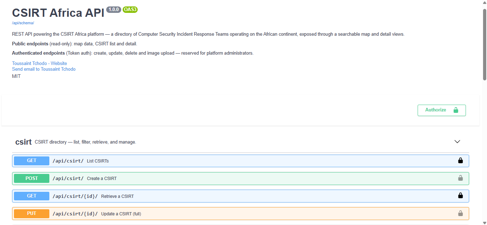
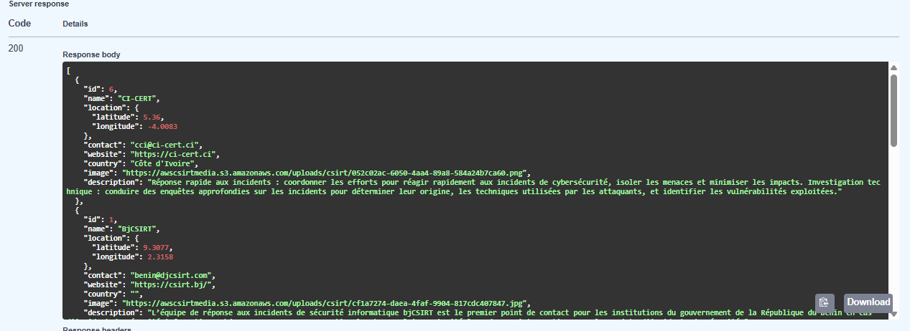

# CSIRT Africa — API

REST backend for the **CSIRT Africa** platform — a directory of *Computer Security Incident Response Teams* operating across the African continent, consumed by an interactive Leaflet map.

Companion frontend repo: **[csirt-app-front](https://github.com/Tchobo/csirt-app-front)** — Vue 3 + Vite + Leaflet.

---

## Screenshots

### Swagger UI — self-documented API
Every endpoint is grouped by tag (`csirt`, `auth`), carries a short summary, a long description, and per-field help text — generated with **drf-spectacular** from the source of truth (views + serializers). Public endpoints are marked with the open padlock; authenticated ones with the closed padlock.



### Django admin — CSIRT list
Full CRUD on CSIRTs through the Django admin, with the same validators (case-insensitive location keys, numeric coordinates in valid ranges) that guard the API.



---

## Features

- **Public read, protected writes** — `GET /api/csirt/` and `GET /api/csirt/{id}/` are anonymous-friendly so the map loads for guests; `POST`, `PUT`, `PATCH`, `DELETE` and `upload-image` require Token authentication.
- **Multi-field search** — a single `?filter=` query parameter runs a case-insensitive substring match across name, country, website and description.
- **Robust location shape** — a shared validator (used by both the DRF serializer and the model's `full_clean()`) rejects malformed `location` JSON regardless of the write path (API, admin, shell, fixtures). The serializer additionally coerces case-mismatched keys (`Latitude` / `LONGITUDE`) and numeric strings to a canonical `{"latitude": float, "longitude": float}` shape.
- **Image upload** — dedicated `POST /api/csirt/{id}/upload-image/` endpoint accepting multipart/form-data. Stored to S3 in production via `django-storages`, on the local filesystem in dev.
- **Token authentication** — `POST /api/user/token/` returns a token; all authenticated calls send `Authorization: Token <token>`.
- **Self-documented OpenAPI schema** — Swagger UI at `/api/docs/`, raw schema at `/api/schema/`, generated from the code (no drift).

---

## Tech stack

| Layer               | Tooling                                                     |
|---------------------|-------------------------------------------------------------|
| Language            | Python 3.9                                                  |
| Framework           | Django 3.2, Django REST Framework                           |
| Database            | PostgreSQL 13                                               |
| API docs            | drf-spectacular (OpenAPI 3, Swagger UI)                     |
| Auth                | DRF Token Authentication                                    |
| Storage             | django-storages + AWS S3 (production), local FS (dev)       |
| WSGI                | gunicorn                                                    |
| Containerisation    | Docker + Docker Compose (with a dev-only override file)     |
| Filtering           | Custom `MultiFieldFilterBackend` + django-filter            |

---

## Getting started

### Prerequisites

- **Docker** and **Docker Compose**
- No local Python setup needed — everything runs in containers.

### 1. Clone and configure

```bash
git clone https://github.com/Tchobo/csirts-app-api.git
cd csirts-app-api
```

Create a `.env` file at the repo root:

```bash
DEBUG=1
SECRET_KEY=your_random_secret_key
DB_NAME=csirtdb
DB_USER=csirtuser
DB_PASS=csirtpass
DB_HOST=db
DB_PORT=5432
```

### 2. Build and start

```bash
docker-compose up --build
```

The `app` service:
- Waits for the database to be ready (`wait_for_db`)
- Applies migrations
- Collects static files
- Starts gunicorn on port `8000` (3 workers)

### 3. Create a superuser (first run only)

```bash
docker-compose exec app python manage.py createsuperuser
```

### 4. Explore

| URL                                    | What                                           |
|----------------------------------------|------------------------------------------------|
| http://localhost:8000/admin/           | Django admin (needs superuser)                 |
| http://localhost:8000/api/docs/        | Swagger UI (public)                            |
| http://localhost:8000/api/schema/      | Raw OpenAPI 3 schema (JSON)                    |
| http://localhost:8000/api/csirt/       | CSIRT list (public — `GET`)                    |
| http://localhost:8000/api/user/token/  | Obtain an auth token (POST email + password)   |

### 5. Dev hot-reload (optional)

A `docker-compose.override.yml` is generated in your local checkout to mount `./app` into the container so Python edits take effect on container restart without rebuilding. The override is **gitignored** on purpose — production compose stays lean.

If you need it, create `docker-compose.override.yml` with:

```yaml
services:
  app:
    volumes:
      - ./app:/app
```

---

## Data shape — the `location` field

Every CSIRT has a JSON `location` object plotted on the frontend map. The shared validator enforces:

```json
{ "latitude": 6.3703, "longitude": 2.3912 }
```

**Accepted variants** (normalised on save):

- Case-insensitive keys: `Latitude` / `LONGITUDE` / `latitude` all work.
- Numeric strings: `"6.3703"` and `"6,3703"` (French decimal comma) are coerced to `float`.
- Range-checked: latitude ∈ `[-90, 90]`, longitude ∈ `[-180, 180]`.

**Rejected**:

- Arrays (`[6.37, 2.39]`)
- Missing key
- Non-numeric values

---

## Testing

```bash
docker-compose exec app python manage.py test
```

---

## Project structure

```
app/
├── app/                # project settings, root urls, ASGI/WSGI
│   ├── settings.py     # SPECTACULAR_SETTINGS, DB config, S3 config
│   └── urls.py         # /admin, /api/docs, /api/schema, /api/user, /api/
├── core/               # shared models (User, Csirt) + model-level validators
│   ├── models.py       # validate_csirt_location + Csirt / User models
│   └── migrations/
├── csirt/              # CSIRT app — ViewSet, serializers, filters
│   ├── views.py        # CsirtViewSet with @extend_schema_view metadata
│   ├── serializers.py  # CsirtSerializer / CsirtDetailSerializer / CsirtImageSerializer
│   ├── filters.py      # MultiFieldFilterBackend
│   └── urls.py
└── user/               # auth app — create, token, manage-me
    ├── views.py        # CreateUserView, CreateTokenView, ManageUserView
    ├── serializers.py
    └── urls.py
```

---

## Contributing

1. Fork the repo.
2. Create a feature branch: `git checkout -b feat/short-name`.
3. Commit with **Conventional Commits** (`feat(scope): …`, `fix(scope): …`).
4. Push and open a PR against `main` with a clear description.

---

## License

MIT.
